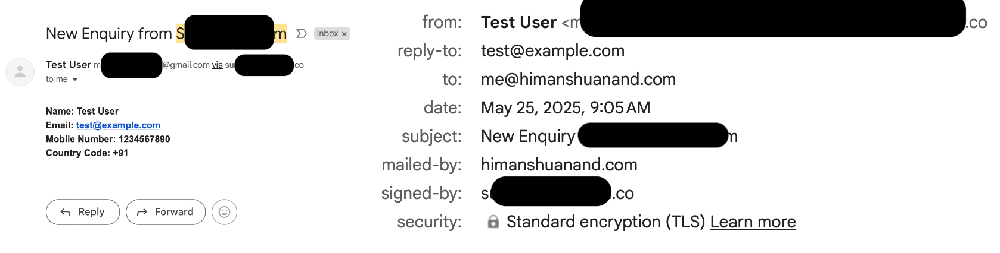

I wanted to quickly highlight something I have noticed in multiple cases but this time let me explain with a real example.  
When code is written purely using LLMs (vibe coded) security often takes a back seat.  
LLMs work on data and most of what is available at training time (essentially scraping the internet) is NOT "secure by default" A lot of examples floating around online are meant to *demonstrate functionality* not teach security best practices. When those patterns are blindly reused or auto generated by an LLM the same insecure logic ends up in **production code**.  

This is NOT my first time stumbling across such issues. Some time ago, I found a bug in Coinbase’s **x402 pay-per-view example code** (not in the core library itself, just the example). When I reported it through HackerOne, it was marked as *informational*—since the problem was only in the sample code. That experience stuck with me because it shows that even **official documentation can contain insecure examples**. If developers copy paste blindly, those vulnerabilities end up in live apps even when the code is not generated using LLM.

And that's the point: security issues in example code are not new. But with LLMs the problem scales faster, because LLMs often mimic those same insecure patterns.  

Now, let me share a **live example** I came across recently.


---

## The Vulnerable App (details redacted)

While browsing, I came across a JavaScript file on a site hosted on railway.com popular PaaS. The file contained this (lightly paraphrased) code:

```js
// Form Submission Handling
const smtp_api = "https://<redacted-domain>/send-email";

const phoneNumberPattern = /^(\\+\\d{1,2}\\s?)?(\\(?\\d{3}\\)?[\\s.-]?)?\\d{3}[\\s.-]?\\d{4}$/;

function validateForm(name, email, number) {
  if (!name || !email || !number) {
    alert("Please fill in all required fields.");
    return false;
  }
  return true;
}

async function submitForm(name, email, number, countryCode = '') {
  const data = {
    name,
    email,
    number,
    country_code: countryCode,
    company_email: "<redacted@redacted>",
    project_name: "<redacted>"
  };

  try {
    const res = await fetch(smtp_api, {
      method: 'POST',
      headers: { 'Content-Type': 'application/json' },
      body: JSON.stringify(data)
    });

    if (res.ok) {
      const responseData = await res.json();
      alert("Successfully submitted. We'll call you.");
      return true;
    } else {
      alert("Something went wrong");
    }
  } catch (error) {
    alert("Something went wrong, please try again");
  }
  return false;
}
```

If you have even a basic sense of security, the problem jumps out:
The entire email API endpoint and parameters are exposed in client side code.
That means anyone can send arbitrary requests to the backend without using the website at all.

## Proof of Concept (redacted)

This trivial PoC demonstrates why exposing a mail-sending API client-side is risky:

```
curl -X POST "https://redacted.example/send-email" \
  -H "Content-Type: application/json" \
  -d '{
    "name": "Test User",
    "email": "test@example.com",
    "number": "1234567890",
    "country_code": "+91",
    "company_email": "me@example.com",
    "project_name": "Redacted Project"
  }'
  ```
  Note: All identifiers and endpoints are redacted. The goal is to highlight the pattern, not to point at a live system.



  Reporting the Bug
I reported it to the hosting provider; since the vulnerable app was third-party code hosted on their platform, it was understandably out of scope.

The real risk here isn't theoretical:

Attackers could spam arbitrary email addresses.

They could target the app's customers with convincing messages.

They could target the organization itself by spoofing trusted senders.
The Bigger Point

The takeaway isn't about bug bounties. It's this:
   LLM generated code is not security-aware by default.
   LLMs do NOT understand business risk, which you do.
   If you ship AI written examples as it is you may be exposing real attack surface.

LLMs are helpful assistants but they are NOT security engineers. Keep humans in the loop for threat modeling, abuse case thinking and defensive design. Otherwise, you might end up shipping an app that can be abused with a single curl command.
